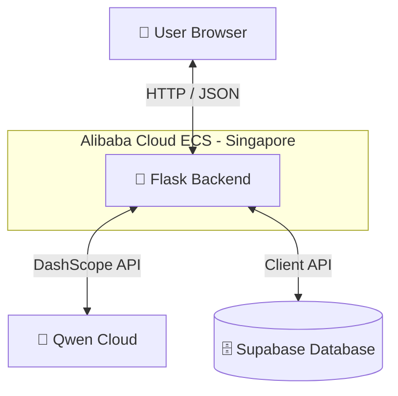

# PennyPal

PennyPal is a smart financial coaching chat agent with persistent memory. Built for the Global AI Hackathon Series with Qwen Cloud (Track 1: MemoryAgent).

It remembers your financial goals, habits, and preferences across separate sessions using Qwen Cloud and Supabase, providing personalized, contextual coaching over time.

## How the Memory System Works

Every conversation turn runs through two Qwen API calls, not one.

**Call 1 — Coaching response:** PennyPal retrieves relevant memories 
from Supabase, injects them into the prompt context, and calls 
qwen-max to generate a personalized coaching reply.

**Call 2 — Memory extraction:** The same exchange is immediately sent 
to qwen-plus with instructions to extract what is worth remembering — 
categorizing it as a Goal, Habit, Feeling, Constraint, or Action 
Commitment, and scoring its importance based on how urgently or 
repeatedly the user expressed it.

This two-model architecture is deliberate:
- **qwen-max** handles coaching responses where quality matters most
- **qwen-plus** handles background memory extraction where speed 
  and cost efficiency matter more

Memories decay over time by category — passing feelings and habits 
lose importance if not mentioned again across sessions, while goals 
and hard financial constraints remain permanent until explicitly 
changed by the user.

When a user changes their mind about something, the old memory is 
archived and linked to the new one rather than deleted — preserving 
the full story of how the user's thinking evolved.

## 🏗️ Architecture



For a detailed view of the architecture and data flows, see [architecture_diagram.md](file:///c:/Users/HP/Desktop/AI%20WORKFLOWS/PennyPal/architecture_diagram.md).

## ✨ Key Features

1. **Multi-Category Memory**: Remembers Goals, Habits, Feelings, Constraints, and Action Commitments.
2. **Dynamic Importance**: Automatically scores and scales memory weight based on repetition and emotional urgency.
3. **Contradiction Linking**: Archives old memories and links them to new ones to preserve the user's financial story.
4. **Memory Decay**: Slowly fades passing feelings and habits over time while keeping goals and hard constraints permanent.
5. **Wise Financial Mentor**: A calm, reflective personality focused on mindfulness and financial education.

## Alibaba Cloud Deployment

PennyPal's backend is deployed on Alibaba Cloud ECS, Singapore region.

- **Live backend health check:** http://47.84.41.212:5000/api/health
- **Proof of deployment:** [add your short proof recording link here]
- **Alibaba Cloud service usage:** backend/app.py

## 🚀 Setup Instructions

### Backend
1. Navigate to the `backend` folder.
2. Create a virtual environment:
   ```bash
   python -m venv venv
   venv\Scripts\activate
   ```
3. Install dependencies:
   ```bash
   pip install -r requirements.txt
   ```
4. Create a `.env` file based on `.env.example` and fill in your API keys:
   * `QWEN_API_KEY`: Your Alibaba DashScope API key.
   * `SUPABASE_URL` & `SUPABASE_KEY`: Your Supabase project credentials.
5. Run the server:
   ```bash
   python app.py
   ```

### Frontend
Open `frontend/index.html` in a web browser. The frontend connects 
to the backend via the API_BASE_URL variable in `frontend/app.js`. 
To point it at the live Alibaba Cloud backend, set:

API_BASE_URL = 'http://47.84.41.212:5000/api'

To run locally, set it to:

API_BASE_URL = 'http://127.0.0.1:5000/api'
