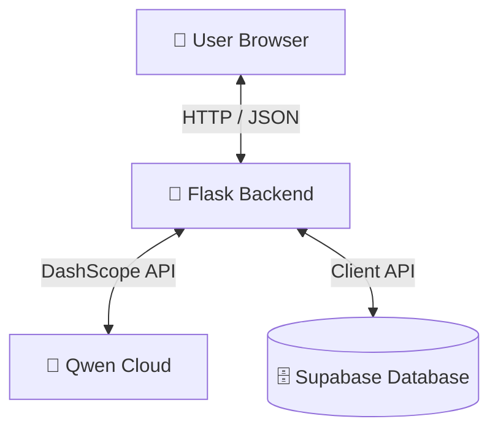

# PennyPal

PennyPal is a smart financial coaching chat agent with persistent memory. Built for the Global AI Hackathon Series with Qwen Cloud (Track 1: MemoryAgent).

It remembers your financial goals, habits, and preferences across separate sessions using Qwen Cloud and Supabase, providing personalized, contextual coaching over time.

## 🏗️ Architecture



For a detailed view of the architecture and data flows, see [architecture_diagram.md](file:///c:/Users/HP/Desktop/AI%20WORKFLOWS/PennyPal/architecture_diagram.md).

## ✨ Key Features

1. **Multi-Category Memory**: Remembers Goals, Habits, Feelings, Constraints, and Action Commitments.
2. **Dynamic Importance**: Automatically scores and scales memory weight based on repetition and emotional urgency.
3. **Contradiction Linking**: Archives old memories and links them to new ones to preserve the user's financial story.
4. **Memory Decay**: Slowly fades passing feelings and habits over time while keeping goals and hard constraints permanent.
5. **Wise Financial Mentor**: A calm, reflective personality focused on mindfulness and financial education.

## 🚀 Setup Instructions

### Backend
1. Navigate to the `backend` folder.
2. Create a virtual environment:
   ```bash
   python -m venv venv
   venv\Scripts\activate
   ```
3. Install dependencies:
   ```bash
   pip install -r requirements.txt
   ```
4. Create a `.env` file based on `.env.example` and fill in your API keys:
   * `QWEN_API_KEY`: Your Alibaba DashScope API key.
   * `SUPABASE_URL` & `SUPABASE_KEY`: Your Supabase project credentials.
5. Run the server:
   ```bash
   python app.py
   ```

### Frontend
Simply open `frontend/index.html` in a web browser, or serve it using any local static file server.
